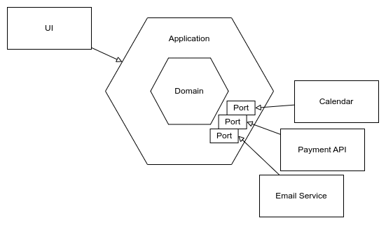
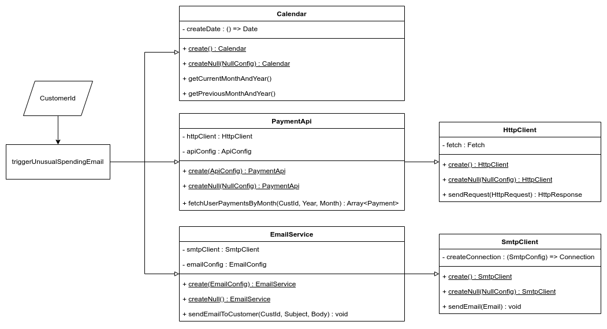

# Nullable Infrastructure Kata

## Introduction

This is an implementation of the [Unusual Spending kata](https://github.com/testdouble/contributing-tests/wiki/Unusual-Spending-Kata)
using James Shore's [Nullable Infrastructure pattern](https://www.jamesshore.com/v2/projects/nullables).
The Nullable Infrastructure pattern is an alternative approach to using [mock
objects](https://martinfowler.com/articles/mocksArentStubs.html) inside tests.

The basic idea is that objects that cause side effects have a kind of an "off
switch". With this we can turn off any interaction with the outside world that
these objects normally have. That way we can use the real objects as
collaborators in our tests and don't have to replace them with mock objects or
other test doubles. An object with this kind of switch is called a "Nullable"
and in its off-state it is called a null-object. (This by the way has nothing to
do with the notion of `null` or a null-pointer.)

We strictly separate all side effects (or "infrastructure") from the core domain
(or business) logic which is completely free of side effects or in other words
"pure". Side effects are all interactions with state that is outside of our
system. They include access to global state like date/time or random number
generators, reading and writing files on disk, network communication, database
queries, third party APIs, and so on.

This separation is at the heart of various architectural patterns like for
example the Hexagonal Architecture (TODO link) which lends itself very well to
the Nullable Infrastructure pattern. In a nutshell Hexagonal Architecture
defines a domain core which is pure. This core then interacts with the outside
world via ports that are then connected to adapaters that implement the concrete
side effects. Using Nullable Infrastructure for implementing these adapters is a
perfect fit.

## The "Unusual Spending" kata

The objective of the Unusual Spending kata is to implement a system that (given
a customer ID) fetches two lists of payments a single customer made. One of the
current month and one of the previous month. In both lists the payment amounts
have to be summed up by payment category. If there is an increase of more than
50% in a category from the previous month to the current month then this is
regarded an unusual spending. If one or more unusual spendings are detected then
the system should send an email to the customer in question, informing them
about the potential issue.

The pure domain logic in this case is the code that sums up the amounts by
category and compares them. The infrastructure consists of a calendar (to get
the current date), an API to load the lists of payments, and an email service
that can send an email by talking to an SMTP server. The UI part is out of the
scope of this kata. All infrastructure classes implement an interface (or port)
that is defined by the domain. This architecture prevents the domain code from
depending on implementation details and also makes it easier to test.

[](https://viewer.diagrams.net/?tags=%7B%7D&lightbox=1&highlight=0000ff&edit=_blank&layers=1&nav=1&title=Unusual%20Spending%20Hexagon.drawio#R%3Cmxfile%3E%3Cdiagram%20name%3D%22Page-1%22%20id%3D%22TCG4UKSa01HB5v_6KEIQ%22%3E3Zjvc5owHIf%2FGl%2B644egvqxi293s5M71ur7a5eBbyA4IF4PC%2FvolJQgYWt1Ni9dXJp8kkjx5wODAnMf5HUVp%2BEB8iAaG5ucD0xkYhq5PLf4hkqJMbGtcBgHFvuxUB2v8B2SoyTTDPmxaHRkhEcNpO%2FRIkoDHWhmilOza3V5I1L5qigJQgrWHIjV9wj4Ly3RiaXV%2BDzgIqyvrmmyJUdVZBpsQ%2BWTXiMzFwJxTQlhZivM5RAJexaUcd%2FtG635iFBJ2yoDh1N25j062WubRirDCGRVoKL9li6JMLlhOlhUVAT7vVBRDyFFAkoE5S4HiGBjQOnWriC9rtgsxg3WKPDFsx73gWcjiiNd0XnzBOVQ7LeqbssiRmjN1UdUMgTLIG5Fc5B0Qfl1a8C6y1ah2QBo3ltVdvX37LmFz6yYyRFKZYP%2FVNVVekGC7IX%2F%2F9e3H%2FXK7BmO1en5ybzfTB3s4VZhSkiU%2BiDFi0YSykHCIKFoSkkoqv4GxQlJCGSNthhwPLX7K8a%2BVZ1H5YlhV3cmbrU4ha%2BVUwFesV4hvSEY9eMcdqQpDNAB2zDF1uyhEiOFtex7%2Fw%2F69STYEf%2Fx6ZDuO6HsGRUdtQ0eqobrRYah9KUHtCwqqtwX9QD9Hqp%2Bdq%2B%2FVz5Hi55z%2F9iQ%2Bov1bOm5rqlt9ezr%2BlJ5aJ3pq9OmppXjqoiIWazW0G%2FcKHqkHz9T9sas3WSefUlb7RFnNPmW1FVkXMcJi2BroFvMF9q7rwSHVmPatq%2FomUP0QudzUcwBT6HQwfBOYeQBMt1Vgkw5exqV4qQdL%2BUC8SfFVENvjqIhNVGLTjyRmdt%2BV8pa8Dmb2wW2pddyWXS%2BPF4Omng8dwqklCiq%2BaNbmgSIc8Nd1x%2BOLF%2B%2FqM4EGeyi6kQ0x9n0xvBNsG%2F052B4eJ3WVrd2B1vx3tLxa%2F6%2Fy2tb4d8pc%2FAU%3D%3C%2Fdiagram%3E%3C%2Fmxfile%3E)

## The Nullable Infrastructure pattern

When testing the domain code that interacts with the infrastructure we want to
avoid triggering side effects for a couple of reasons. Side effects make our
tests slow because they have to wait for file or even network I/O. Our tests
become harder to set up because we have to take care of external dependencies
like files, APIs or databases. Also, our tests become dependent on this external
state as well. Whether they succeed or fail depends on the state these other
systems are in.

For this reason why we implement our domain logic in a way so that we can pass
the infrastructure implementations in. This pattern is called "dependency
injection" (TODO link) because we pass in (or "inject") the dependencies our
code needs. It enables us to pass in implementations of the infrastructure
interfaces that we have full control over and that we can configure to behave
exactly the way we need them to in each individual test.

One popular approach to provide such controlled infrastructure objects is to use
so-called "mock objects" or "mocks". These are objects that implement the same
interfaces as our infrastructure but are completely separate from our own
production implementations. They are usually created using a mocking library or
framework that automatically creates mock objects for a given interface. A
significant downside of this approach is that tests that use mocks focus on
testing the interactions between the tested code and the injected dependency
instead of the resulting behavior. In general this leads to tests that are
tightly coupled to implementation internals and that tend to hinder refactoring.

The second approach is to use "fakes". These are implementations of our
infrastructure interfaces that are specifically designed to be used inside
tests. For example we might use an in-memory database implementation instead of
the real one. Unless we already have such implementations for other reasons this
strategy causes a sigificant amount of maintenance effort. Also, the behavior of
the fake implementation needs to match the real one very closely.

Nullables offer a different option to this problem. As described above Nullable
objects provide an "off switch" that allows us to use the actual production
implementations but with their side effect short-circuited. This keeps our tests
fast and independent of external state. It also avoids the need for third party
mocking frameworks that can get quite complex. Additionally it results in stable
tests that don't break easily when the code is refactored. This encourages the
practice of evolutionary design (TODO link).

## The Nullable Infrastructure implementation

It demonstrates the use of

- Configurable responses
- Output tracking
- Parameterless instantiation
- Embedded stubs
- Narrow sociable tests
- State-based tests
- Zero-impact instantiation (?)
- Narrow integration tests (?)
- Paranoic telemetry
- Nullables

[](https://viewer.diagrams.net/?tags=%7B%7D&lightbox=1&highlight=0000ff&edit=_blank&layers=1&nav=1&title=Unusual%20Spending.drawio#R%3Cmxfile%3E%3Cdiagram%20name%3D%22Page-1%22%20id%3D%22Kcyi-Vj68U4RgMjqVgWU%22%3E7Zxbc5s4FIB%2FjWfSh%2BwY4%2Btj7CTb3Ul33Lid7u6bbGRQK5ArRGz31%2FcIxM3gW2LA29VMLnAQWOh8OhcdcMucuJvfOVo5H5iFaavTtjYt877V6Rhdswv%2FpGQbSQbDYSSwObFUo1QwIz%2BwEraVNCAW9nMNBWNUkFVeuGCehxciJ0Ocs3W%2B2ZLR%2FKeukI0LgtkC0aL0C7GEE0mHvXYqf4%2BJ7cSfbLTVERfFjZXAd5DF1hmR%2BdAyJ5wxEW25mwmmcvDicYnOe9xzNOkYx5445YQf7X8td%2Fgn%2Bjj98mn0%2BN7%2BeD%2F%2B%2BzbpnNjGd4wtGAC1y7hwmM08RB9S6ZizwLOwvGwb9tI2T4ytQGiA8CsWYqu0iQLBQOQIl6qj2LPupG5gd07Z4lskeiSUqmtGnZI92XuzSuSzgC9Uq%2FHzeGQ5c4K%2Ff9%2FMvnJj6z3Pb2NoELexODASg0QlwDJmLhZ8C%2BdxTJEgL%2Fl%2BIAWVnbRTp8JdoW2mwYoRT%2FiZK0%2BlABqo%2BdEZqPFXs8Ns7%2BjwSHvDyLWHjagH8V7mVlJRyMU5jBj%2FQ0ZK243eyEhGT69QQ0erQbX7T87V7qh70bl6aAhfEA3UMAhObBvzz17gB4jOVqA94tkPLiK0wFOelrVDBJ6tUKizNbj3PBl79fyCucCbjKioqU08hLkRSkZsnXpaY6hkTsbL9ttvn2Olw2cWhq%2BJOff6GdQ5dQaVztoaLNuhXmdGfRL4Ai7O%2F7AK4w9h1EpuwvAgSjFlNkcuDNoKcwLdwXz32DQ9cAzpJdngOAa9EOL9HYfdL0G8UxHipW6k96t7kdGpc8BskvlRgfkp2rpws3crUmR%2BTVyKPKmKJfNErCw5sogS24PtBZwaIi7RJJC%2F3KkDQqpovHAItZ7QlgVySHyBFt%2FivbHDOPkBl0WxtuAwF0qXnX6uxUyeqXTGsQ9tprGKjB3RB7TJNXxCvlCCBaMUrXwyT27DBW0Rb8wETPv63M%2Bu%2FzH6hclpjkomp9EfVoRFnPZmuLiVHy7EakIJDuOLlnkHf99nRDu4wO2LUI2cfcMTRpm0iR6L%2BIE5tyOKEaJ4KfYC5IMiIG54Ctvcd1PJsxoWKWJw7pKG09whloW90HYIJFCkaalWFWZBR3tj%2BIH7nbR%2F67V60PEJ7BvpPvzI5lxMmAf3gkioaAwYrbFE6XxCDs7E49jEmJxISdzu8plArxQStCIwUktiJ4zcpRKNyH5ECqo%2FlZq9iPQ69SFSbkeKiUCBAUpC3UYMxItbxqsAcEGVYaSgNP4pjAtujQIVZpEKs4QAiuaYTplPBGHy%2Bjxqu0PGMeXn6SaeA5GgqNAwDIanab0y51EMpFudsbQGnT6VNx7Ahi03FhwjgW8S%2B%2FAuMRnZKCQ6CbqSnKftSL2uZti0qzHKMuIDSP0VUHoj%2F2iurtk%2FGcaJDsqsKg3da6uWWCyczz7mihh%2FvP0AqYdzI9cE5HoAfF77H4x4tBUeSzFTi3p95MqRDDlT10mEGrgmgOs2HhEVLdmBFEpn3JVk3IPhTsZtGgUsOmUrvoZZWdDULU2mQjOUmJXHaE%2FbjDcEP8kEfEuiXQpHdTajmGjrLOrMLOp8tZckz6Vqr8wi9M9Mo9LwI%2BtRdJTbuAEpKbZUZkDKo9wzUdqbPmmw6o1m9xWH9uflNYM12AOWjz3rGX8PYHxuJDRqO0%2FSM%2FZXMKJYc1MzN2V5d73g9As6%2F8XKv%2FHMOFr%2FbfaZh5IJHD6TM8P8hSyKM1MnpLWUgLunLowZ%2FW5VZAxLE1LfLZSAZ64uAV8mshyczM3V1ICLkaWkBEsbslMFfsjKNCcXdvh7nkW9mkJw8UGjAgR6CePS5qHpSnD8ROHJSxgZG%2FEubziSgESnnY17nebLwcXF8uPrGRqoq3VPJ9eBqyOqbIl9nBRrvbkf6gzSxRCeTyx%2BNDxXD54F86%2Fy7b9wZ8ysbcrcC4PP11zVzJV5ogOsLO5JUsGUqwPpks6uayn3duMnV5sr98bh707eFLmrSfQSsQw1Y%2FNxE1KTCYzudx8kaWfP0nbmDQHRGYBdS4W4c8IbYzq9urTam64Qd84MgzMhcNYJ6QC4cQPSfIW4uNr7ugqxBqveCPj8VL1msMoW%2FuIKcZhLRYs%2BOlNqlJPmK8LFQuQEUWBEPmGt06TLkHFeEdIsOqXqapClTJSXICMPdA%2B%2FaXq0LymKWmlj8mpkzvmSomspSupa07Fk6PJKP7XCeIFcqDzOOLfUlAYcqZ%2FRAWvTtqMkEaq5EFD2xvJrEiFN1fVQ1XjBsnR9TlJlYzEJeBgfyjcI7zxLvlMojZMmpE5Cmq9A7l3MA0SmHL8QFviakUYZqbCaCLvpV7BG38KXfpGt%2BfAT%3C%2Fdiagram%3E%3C%2Fmxfile%3E)
